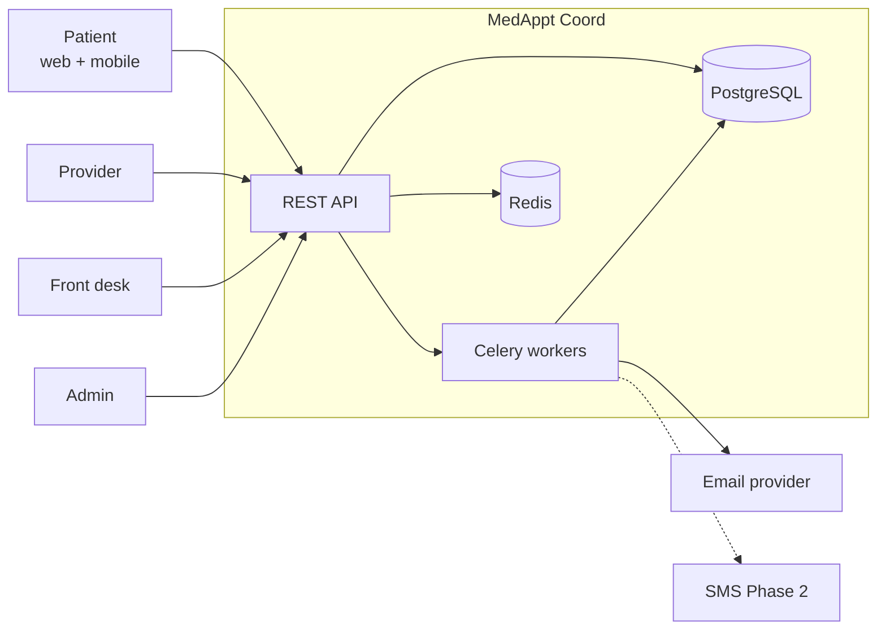
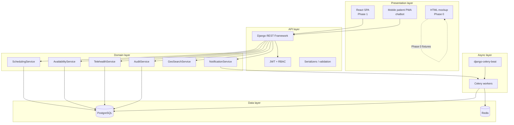
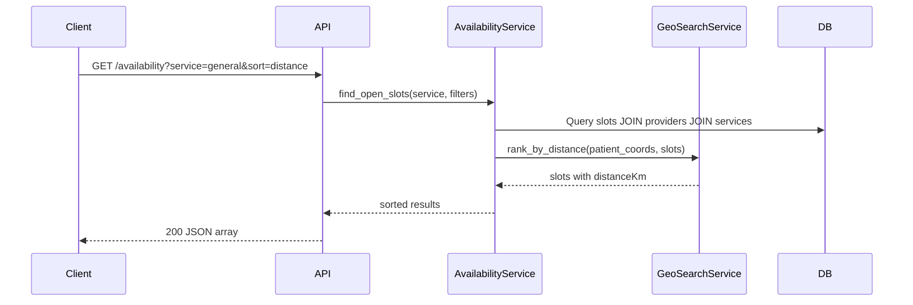
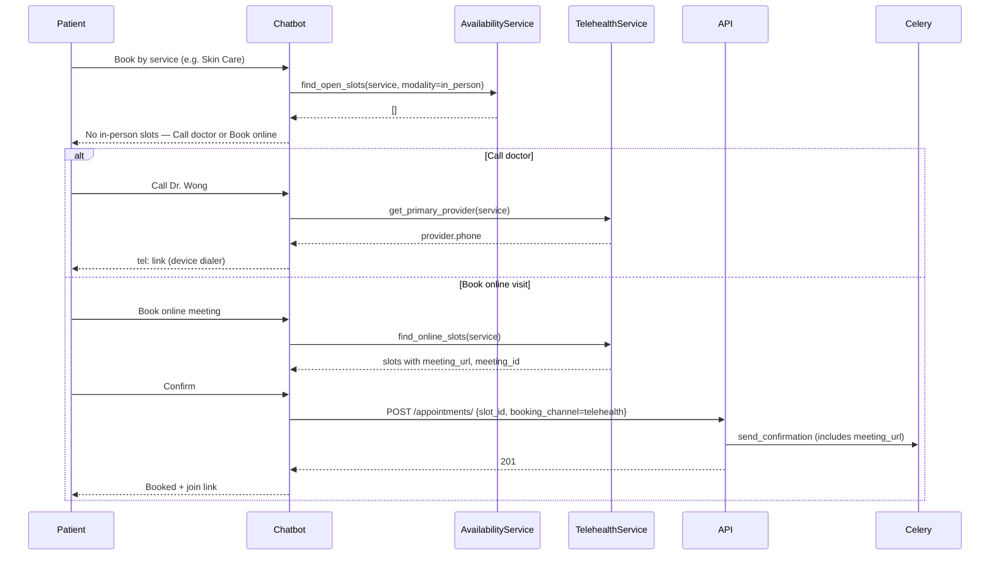
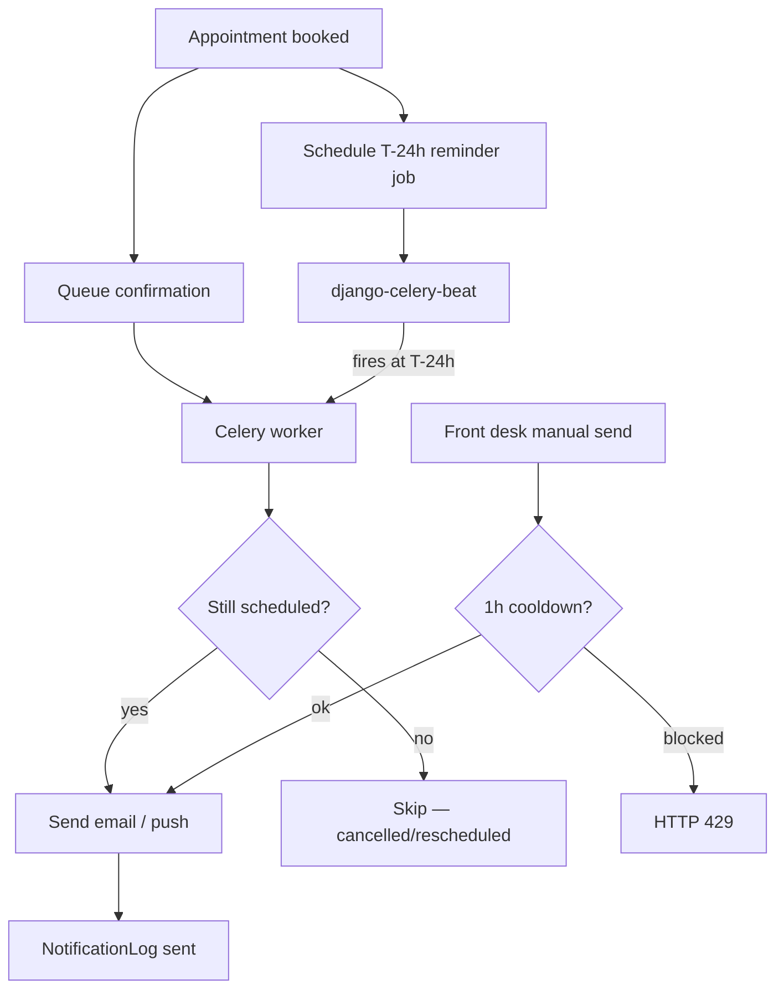
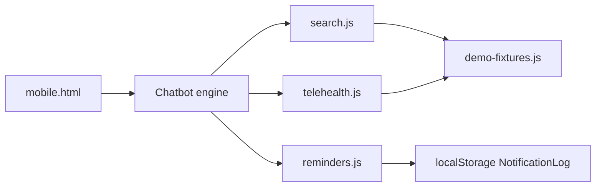
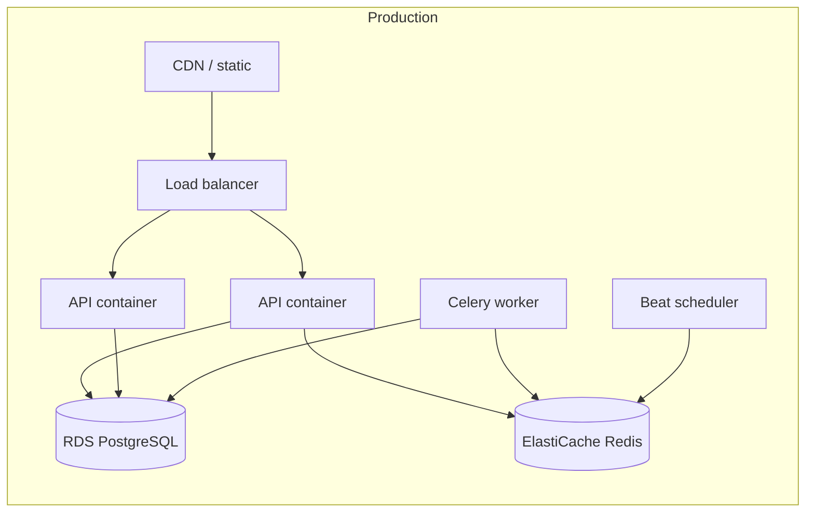

# Software Architecture — Medical Appointment Coordination

**Our Clinic** · Full-clinic appointment platform for patients, providers, front-desk, and admin.

**Stack:** Django 5 + DRF + PostgreSQL + Redis/Celery + React (TypeScript)  
**Phase 0 (current):** Static HTML mockup + Python prototype server with mock API  
**Phase 1+:** Production implementation per this document

See also: [PLAN.md](PLAN.md) (user stories **US-4.8**, **US-4.9**, NFRs, datasets) · [prototype/README.md](../prototype/README.md) (run locally)

---

## 1. System context



| Actor | Channels | Primary capabilities |
|-------|----------|-------------------|
| **Patient (P-1)** | Desktop web, mobile web/PWA, chatbot | Search availability, closest practitioner, book/cancel, **telehealth fallback (call / online visit)**, reminders |
| **Provider (P-2)** | Desktop web | Availability templates, calendar, visit outcomes |
| **Front desk (P-3)** | Desktop web | Day view, walk-in booking, check-in, call log, manual reminder |
| **Admin (P-4)** | Desktop web | Locations, users, booking rules, reports |

---

## 2. Layered architecture



### Layer responsibilities

| Layer | Responsibility | Does not |
|-------|----------------|----------|
| **Presentation** | Role-based UI, form validation, optimistic UX | Own business rules or direct DB access |
| **API** | HTTP contract, auth, input validation, pagination | Embed scheduling logic in views |
| **Domain** | Booking rules, slot locking, reminder scheduling | Know about HTTP or React |
| **Data** | Persistence, constraints, indexes | Send emails |
| **Async** | Email/SMS delivery, reminder batch jobs, retries | Block HTTP responses |

---

## 3. Core domain model

```mermaid
erDiagram
  User ||--o| PatientProfile : has
  User ||--o| ProviderProfile : has
  User ||--o| StaffProfile : has

  Clinic ||--{ Location : has
  Clinic ||--{ AppointmentType : defines
  Clinic ||--{ Service : offers

  ProviderProfile ||--{ ProviderAvailability : sets
  ProviderProfile ||--{ ProviderBlock : blocks
  ProviderProfile }o--{ Specialty : practices
  ProviderProfile }o--|| Location : based_at

  Location ||--{ Slot : generates
  ProviderProfile ||--{ Slot : owns
  AppointmentType ||--{ Slot : typed

  PatientProfile ||--{ Appointment : books
  Slot ||--o| Appointment : reserves
  ProviderProfile ||--{ Appointment : attends

  Appointment ||--{ AppointmentEvent : logs
  Appointment ||--o{ NotificationLog : triggers
  CallRecord }o--o| Appointment : source_call

  Appointment {
    string booking_channel
    string meeting_url
    string meeting_id
    string modality
  }

  ProviderProfile {
    string phone
    bool telehealth_enabled
  }

  Slot {
    string modality
    string status
  }

  NotificationLog {
    string type
    string channel
    string status
    datetime scheduled_at
    datetime sent_at
  }
```

### Key entities

| Entity | Purpose |
|--------|---------|
| **Slot** | Atomic bookable unit — `available \| held \| booked \| blocked`; **modality:** `in_person \| telehealth` |
| **Appointment** | Patient + slot + type — `scheduled \| checked_in \| completed \| cancelled \| no_show`; **`booking_channel`:** includes `telehealth`, `mobile_chat`; telehealth stores `meeting_url` |
| **Service** | Patient-facing care category (cardio, general, dermatology) with IVR mapping |
| **ProviderProfile** | Specialty, location, **phone**, **`telehealth_enabled`** — used for call-doctor fallback |
| **CallRecord** | Phone/IVR transcript metadata (Kaggle dataset alignment) |
| **NotificationLog** | Confirmation and reminder delivery audit — `queued \| sent \| failed` |
| **AppointmentEvent** | Immutable state-change trail |

---

## 4. Scheduling & availability

### Availability search (US-4.6, US-4.7)



**Closest practitioner:** group slots by provider → earliest slot per provider → sort by haversine distance, then time.

**Prototype:** `frontend/mockup/js/search.js` + `GET /api/v1/availability/closest` in `prototype/server.py`.

### Telehealth fallback (US-4.9)

When in-person search returns zero slots, the mobile chatbot must not dead-end — it offers **call the doctor** or **book an online video visit** (mirrors Kaggle call 005: dermatology fully booked).



| Step | Production | Phase 0 prototype |
|------|------------|-------------------|
| Detect empty in-person | `AvailabilityService` returns `[]` | `searchAvailabilityByService()` → `[]` |
| Provider phone | `ProviderProfile.phone` | `demo-fixtures.js` providers |
| Online slots | `TelehealthService.find_online_slots()` | `getOnlineMeetings()` in `telehealth.js` |
| Chat UX | React mobile PWA | `showNoAvailabilityFallback()` in `chatbot.js` |
| Book telehealth | Same `SchedulingService.create_appointment()` with `modality=telehealth` | `completeOnlineBooking()` → localStorage |

**TelehealthService (planned):**

```python
# backend/apps/scheduling/telehealth.py (planned)

class TelehealthService:
    def get_primary_provider(self, service_id: str) -> ProviderProfile: ...
    def find_online_slots(self, service_id: str) -> list[Slot]: ...
    def provision_meeting_url(self, appointment_id: int) -> str: ...  # Phase 2: Zoom/Teams integration
```

### Booking with concurrency (US-4.2)

```mermaid
sequenceDiagram
  participant Client
  participant API
  participant Sched as SchedulingService
  participant DB
  participant Queue as Celery

  Client->>API: POST /appointments/ {slot_id}
  API->>Sched: create_appointment()
  Sched->>DB: BEGIN; SELECT slot FOR UPDATE
  alt slot available
    Sched->>DB: INSERT appointment; UPDATE slot booked
    Sched->>DB: COMMIT
    API->>Queue: send_confirmation.delay(appt_id)
    API->>Queue: schedule_reminder.delay(appt_id, T-24h)
    API-->>Client: 201 Created
  else slot taken
    Sched->>DB: ROLLBACK
    API-->>Client: 409 Conflict
  end
```

---

## 5. Notification & reminder architecture (US-4.4, US-7.1, US-7.2, US-5.5)

### Reminder policy

| Event | Channel | Timing | Idempotency key |
|-------|---------|--------|-----------------|
| Booking confirmed | Email | Within 5 s of HTTP 201 | `confirm:{appointment_id}` |
| Telehealth booking confirmed | Email | Within 5 s; body includes **meeting_url** | `confirm:{appointment_id}` |
| Appointment reminder | Email (+ push Phase 2) | T−24 h clinic local time | `reminder:{appointment_id}` |
| Manual re-send | Email | On staff action | `manual:{appointment_id}:{hour_bucket}` |
| Provider cancel alert | Email | On patient cancel | `provider_cancel:{appointment_id}` |



### NotificationService (production)

```python
# backend/apps/notifications/services.py (planned)

class NotificationService:
    def queue_confirmation(self, appointment_id: int) -> NotificationLog: ...
    def schedule_reminder(self, appointment_id: int) -> NotificationLog: ...
    def send_manual_reminder(self, appointment_id: int, staff_user_id: int) -> NotificationLog: ...
    def run_due_reminders(self) -> int: ...  # batch job
```

**Rules:**
- Reminder jobs are **idempotent** — duplicate beat runs must not double-send.
- Cancelled appointments are excluded from reminder batches.
- Job failure does **not** roll back the appointment (NFR-3.6).
- Timestamps stored in **UTC**; T−24 h computed in **clinic timezone** (handles DST).

### Prototype implementation

| Component | Location |
|-----------|----------|
| Reminder UI + notification log | `frontend/mockup/js/reminders.js` |
| Patient appointment badges | `patient/appointments.html`, `patient/dashboard.html`, `patient/mobile.html` |
| Desk manual send (US-5.5) | `desk/checkin.html` |
| Mock API | `GET/POST /api/v1/notifications/*` in `prototype/server.py` |
| Sample notification log | `data/demo/prototype-data.json` |

---

## 6. Mobile patient channel (US-4.8, US-4.9)



- **Mobile-first** layout (`css/mobile.css`), max-width 480px, bottom tab bar.
- **Chatbot (US-4.8)** handles book, nearest doctor, list/cancel — uses same domain functions as desktop search.
- **Telehealth fallback (US-4.9):** when `searchAvailabilityByService()` or `findClosestPractitioner()` returns no in-person slots, `showNoAvailabilityFallback()` offers call-doctor (`tel:`) and online meeting booking; online appointments use `bookingChannel: "telehealth"`.
- **Push reminders (Phase 2):** service worker + Web Push; Phase 0 simulates with in-app banner and email log.

---

## 7. API surface (v1)

| Resource | Method | Endpoint | Roles |
|----------|--------|----------|-------|
| Health | GET | `/api/v1/health` | Public |
| Auth | POST | `/api/v1/auth/login` | Public |
| Availability | GET | `/api/v1/availability?service=&sort=` | Patient, Staff |
| Online availability | GET | `/api/v1/availability/online?service=` | Patient |
| Closest | GET | `/api/v1/availability/closest?service=&lat=&lng=` | Patient |
| Appointments | POST | `/api/v1/appointments/` | Patient, Staff |
| Appointments | PATCH | `/api/v1/appointments/{id}/cancel` | Patient, Staff |
| Notifications | GET | `/api/v1/notifications?appointment=` | Patient, Staff |
| Reminder | POST | `/api/v1/notifications/reminder` | Staff (manual) |
| Reminder batch | POST | `/api/v1/notifications/reminder/run-due` | System / Admin demo |
| Calls | GET | `/api/v1/calls?intent=&service=` | FrontDesk, Admin |

---

## 8. Project structure

```
team06-Medical-Appointment-Coordination/
├── docs/
│   ├── PLAN.md                 # User stories, NFRs, datasets
│   └── ARCHITECTURE.md         # This document
├── prototype/
│   └── server.py               # Phase 0: static UI + mock API
├── backend/                    # Phase 1: Django apps
│   ├── config/
│   └── apps/
│       ├── accounts/
│       ├── clinics/
│       ├── providers/
│       ├── scheduling/
│       ├── notifications/      # Email, reminders, NotificationLog
│       └── audit/
├── frontend/
│   ├── mockup/                 # Phase 0 clickable prototype
│   │   ├── patient/mobile.html # Mobile + chatbot
│   │   └── js/
│   │       ├── search.js
│   │       ├── telehealth.js   # US-4.9 call + online fallback
│   │       ├── chatbot.js      # US-4.8 mobile chatbot
│   │       └── reminders.js
│   └── src/                    # Phase 1 React SPA
├── data/
│   ├── demo/prototype-data.json
│   └── kaggle/...
└── docker-compose.yml          # Phase 1: postgres, redis, api, worker
```

---

## 9. Cross-cutting concerns

| Concern | Approach |
|---------|----------|
| **Concurrency** | `SELECT FOR UPDATE` on slot row during booking |
| **RBAC** | DRF permission classes; object-level checks per role |
| **Timezone** | UTC storage; clinic TZ for display and T−24 h reminders |
| **Idempotency** | Booking POST accepts idempotency key; notification jobs use deterministic keys |
| **Audit** | AppointmentEvent + NotificationLog + admin audit app |
| **PHI** | Synthetic data only in dev; encrypt at rest in production |
| **Testing** | pytest (API), Playwright (E2E), Celery eager mode (notifications) |

---

## 10. Deployment (future)



**Target:** Docker on Railway, Render, Fly.io, or AWS ECS.  
**Observability:** Structured logs, health checks on `/api/v1/health`, Celery task monitoring.

---

## 11. Implementation phases

| Phase | Scope | Status |
|-------|-------|--------|
| **0** | HTML mockup, mobile chatbot, **telehealth fallback**, mock API, Kaggle pipeline | ✅ Current |
| **1** | Django models, JWT auth, seed data | Planned |
| **2** | Slot generation, booking API, React patient/provider UI | Planned |
| **3** | Front-desk flows, admin config | Planned |
| **4** | Celery email + T−24 h reminders, E2E tests | Planned |

---

## 12. Technology decisions

| Decision | Choice | Rationale |
|----------|--------|-----------|
| Backend | Django 5 + DRF | Mature ORM, admin, ecosystem |
| Database | PostgreSQL 16 | Row locks, JSON fields, reliability |
| Task queue | Celery + Redis | Reminder scheduling, email isolation |
| Reminder scheduler | django-celery-beat | Cron-style T−24 h jobs per clinic TZ |
| Frontend | React 18 + TypeScript + Vite | Typed SPA, component reuse from mockup |
| Mobile | Responsive PWA + chatbot + telehealth fallback | Maria persona; smartphone-first booking; US-4.8 / US-4.9 |
| Telehealth | Video visit slots + meeting URLs | Phase 0 fixtures; Phase 2 vendor integration (Zoom/Teams) optional |
| Dev dataset | Kaggle call transcripts + demo fixtures | Aligns with course dataset requirement |
