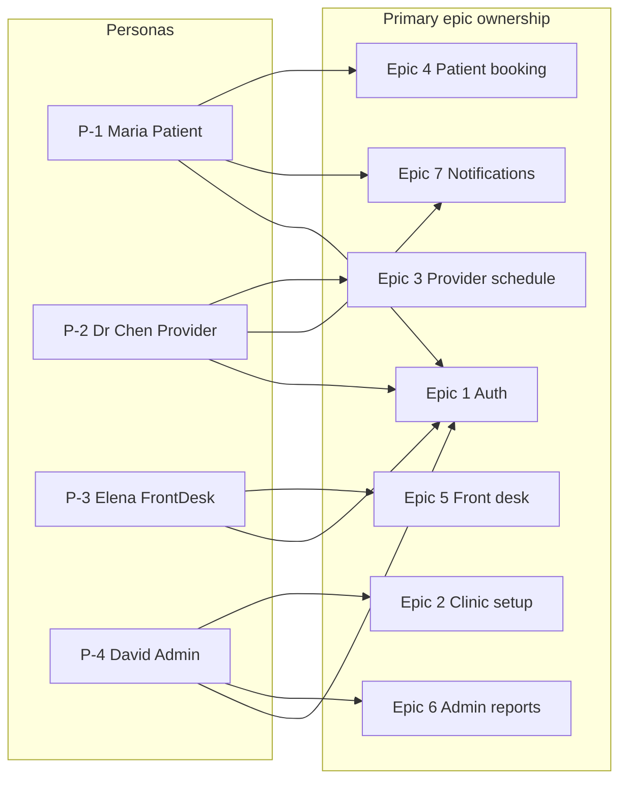
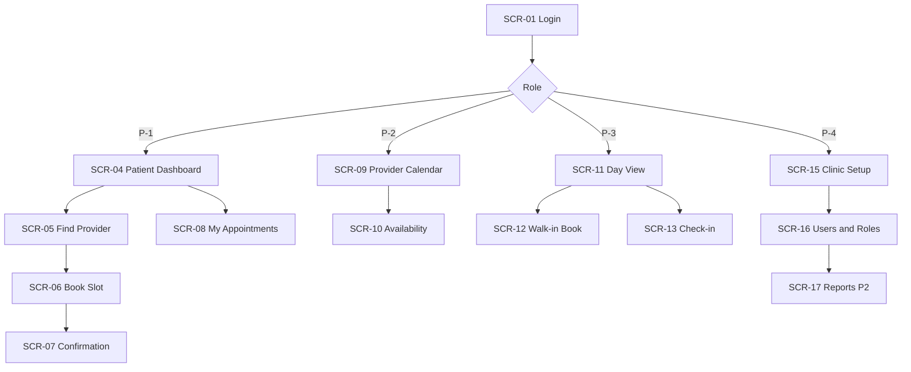
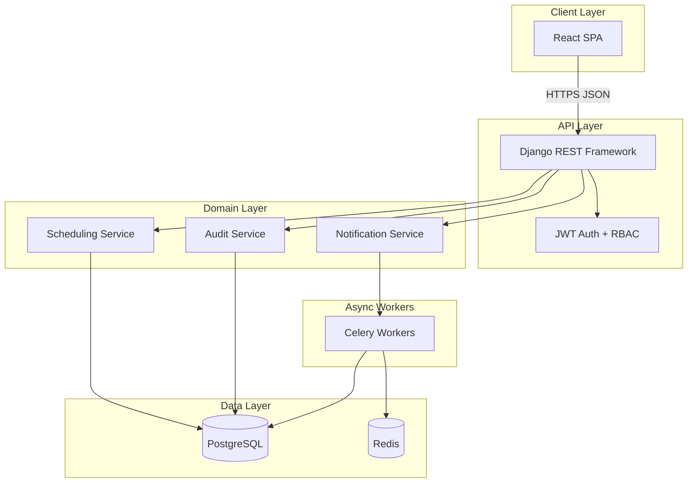
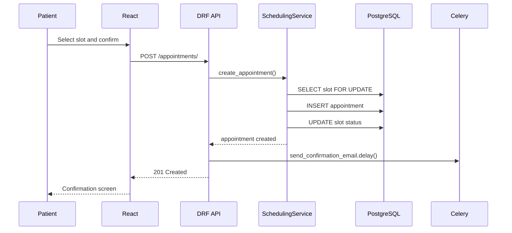

# Medical Appointment Coordination — User Stories, Architecture & Test Data

## Goals

Build a **full-clinic** appointment coordination platform where **patients**, **providers**, **front-desk staff**, and **clinic admins** can manage scheduling end-to-end. Stack: **Django + Django REST Framework (DRF) + PostgreSQL + React (TypeScript)**.

This plan covers **Phase 0 only**: user stories, non-functional requirements, architecture, and dataset strategy — no implementation yet.

---

## Non-Functional Requirements (Basis)

These NFRs define **how** the system must behave. They apply to all epics and phases unless explicitly marked as Phase 2+.

### NFR-1 — Performance


| ID      | Requirement                                                       | Target (MVP)                                        | Verification                                    |
| ------- | ----------------------------------------------------------------- | --------------------------------------------------- | ----------------------------------------------- |
| NFR-1.1 | API response time for read endpoints (slot search, calendar view) | p95 ≤ 500 ms under normal load                      | Load test with k6/Locust                        |
| NFR-1.2 | API response time for write endpoints (book, cancel, check-in)    | p95 ≤ 800 ms                                        | Load test + integration tests                   |
| NFR-1.3 | Concurrent booking attempts on the same slot                      | Exactly one succeeds; others receive `409 Conflict` | Concurrency integration test                    |
| NFR-1.4 | Initial React app load (first contentful paint)                   | ≤ 3 s on 4G / mid-tier device                       | Lighthouse CI                                   |
| NFR-1.5 | Slot search for a single provider/day                             | ≤ 200 ms DB query time                              | Django Debug Toolbar / query logging in staging |


**Normal load (MVP):** 1 clinic, ≤ 20 providers, ≤ 50 concurrent users, ≤ 500 appointments/day.

---

### NFR-2 — Security and privacy


| ID      | Requirement           | Target                                                                                     | Verification                        |
| ------- | --------------------- | ------------------------------------------------------------------------------------------ | ----------------------------------- |
| NFR-2.1 | Transport encryption  | TLS 1.2+ on all environments except local dev                                              | SSL scan / deployment config review |
| NFR-2.2 | Authentication        | JWT with short-lived access tokens (≤ 15 min) + refresh rotation                           | Security test suite                 |
| NFR-2.3 | Password storage      | bcrypt/Argon2 via Django defaults; min 10 chars, complexity rules                          | Unit tests on auth module           |
| NFR-2.4 | Authorization         | RBAC enforced on every API endpoint; object-level checks for patient/provider data         | Permission integration tests        |
| NFR-2.5 | Session invalidation  | Deactivated users lose access within 1 token refresh cycle                                 | Manual + automated test             |
| NFR-2.6 | Audit trail           | All appointment state changes and admin actions logged with actor, timestamp, before/after | Audit log inspection                |
| NFR-2.7 | PHI in non-production | **No real patient data** in dev/staging; synthetic data only (Medscheduler)                | Data seed policy + CI check         |
| NFR-2.8 | Secrets management    | API keys, DB credentials, JWT secret in env vars / secret store — never in source control  | Pre-commit secret scan              |
| NFR-2.9 | Input validation      | All API inputs validated server-side; parameterized queries only (ORM)                     | OWASP ZAP / DAST in CI (Phase 2)    |


**Phase 2 (production healthcare):** Field-level encryption for PHI, BAA with cloud provider, HIPAA Security Rule controls.

---

### NFR-3 — Availability and reliability


| ID      | Requirement                    | Target (MVP)                                                                             | Verification                      |
| ------- | ------------------------------ | ---------------------------------------------------------------------------------------- | --------------------------------- |
| NFR-3.1 | Uptime                         | 99.5% monthly (excludes planned maintenance)                                             | Uptime monitor (e.g. UptimeRobot) |
| NFR-3.2 | Planned maintenance window     | ≤ 4 h/month, announced 24 h ahead                                                        | Ops runbook                       |
| NFR-3.3 | Database backups               | Daily automated backups; 30-day retention                                                | Backup job logs                   |
| NFR-3.4 | Recovery point objective (RPO) | ≤ 24 h (MVP)                                                                             | Restore drill                     |
| NFR-3.5 | Recovery time objective (RTO)  | ≤ 4 h (MVP)                                                                              | Restore drill                     |
| NFR-3.6 | Graceful degradation           | If email queue fails, booking still succeeds; notification retried async                 | Failure injection test            |
| NFR-3.7 | Idempotent booking             | Duplicate `POST /appointments/` with same idempotency key does not create double booking | API integration test              |


---

### NFR-4 — Scalability


| ID      | Requirement                      | Target                                                              | Verification                   |
| ------- | -------------------------------- | ------------------------------------------------------------------- | ------------------------------ |
| NFR-4.1 | Horizontal API scaling           | Stateless Django workers behind load balancer                       | Deploy 2+ replicas in staging  |
| NFR-4.2 | Database growth                  | Schema supports ≥ 1M appointments without query plan regression     | Index review + EXPLAIN ANALYZE |
| NFR-4.3 | Async workload isolation         | Notification/reminder jobs run on Celery workers, not blocking HTTP | Architecture review            |
| NFR-4.4 | Multi-clinic readiness (Phase 2) | Tenant/clinic ID on all domain tables; no cross-clinic data leakage | Multi-tenant integration tests |


**MVP scope:** Single clinic; schema designed with `clinic_id` foreign key for future multi-tenancy.

---

### NFR-5 — Usability and accessibility


| ID      | Requirement             | Target                                                                              | Verification                               |
| ------- | ----------------------- | ----------------------------------------------------------------------------------- | ------------------------------------------ |
| NFR-5.1 | Role-appropriate UI     | Each role lands on a dashboard relevant to their tasks within 2 clicks              | UX review                                  |
| NFR-5.2 | Booking flow completion | Patient can book an appointment in ≤ 5 steps from login                             | Usability test                             |
| NFR-5.3 | Error messages          | User-facing errors are plain language; no stack traces or internal IDs exposed      | QA checklist                               |
| NFR-5.4 | Accessibility           | WCAG 2.1 Level AA for patient-facing flows                                          | axe-core in CI + manual screen-reader test |
| NFR-5.5 | Responsive design       | Usable on desktop (1280px+) and tablet (768px+); phone read-only acceptable for MVP | Cross-device QA                            |
| NFR-5.6 | Timezone clarity        | All displayed appointment times include clinic timezone label                       | UI review                                  |


---

### NFR-6 — Maintainability and operability


| ID      | Requirement         | Target                                                                  | Verification            |
| ------- | ------------------- | ----------------------------------------------------------------------- | ----------------------- |
| NFR-6.1 | Code coverage       | ≥ 80% on scheduling and auth modules                                    | pytest-cov in CI        |
| NFR-6.2 | API documentation   | OpenAPI 3 schema auto-generated from DRF (`drf-spectacular`)            | Schema diff in CI       |
| NFR-6.3 | Structured logging  | JSON logs with request ID, user ID, endpoint, duration                  | Log inspection          |
| NFR-6.4 | Health checks       | `GET /health/` returns DB and Redis connectivity                        | K8s/Docker health probe |
| NFR-6.5 | Deployment          | Reproducible via Docker Compose (dev) and CI/CD pipeline (staging/prod) | One-command deploy test |
| NFR-6.6 | Database migrations | All schema changes via Django migrations; no manual DDL in prod         | Migration review in PRs |
| NFR-6.7 | Dependency updates  | Monthly security patch review for Django, React, and transitive deps    | Dependabot / pip-audit  |


---

### NFR-7 — Data integrity and consistency


| ID      | Requirement                | Target                                                                     | Verification                        |
| ------- | -------------------------- | -------------------------------------------------------------------------- | ----------------------------------- |
| NFR-7.1 | Slot-appointment invariant | A slot in `booked` status has exactly one active appointment               | DB constraint + service-layer check |
| NFR-7.2 | Atomic booking             | Book/cancel/reschedule operations are transactional (all-or-nothing)       | Integration tests with rollback     |
| NFR-7.3 | Immutable event log        | `AppointmentEvent` records are append-only; no updates or deletes          | Model + admin policy                |
| NFR-7.4 | Timestamp storage          | All datetimes stored as UTC (`timestamptz` in PostgreSQL)                  | Schema review                       |
| NFR-7.5 | Soft delete                | Patient and provider records soft-deleted; appointments retained for audit | Model design review                 |
| NFR-7.6 | Referential integrity      | Foreign keys enforced at DB level for core entities                        | Migration/schema review             |


---

### NFR-8 — Compatibility and interoperability


| ID      | Requirement                | Target                                                                | Verification                          |
| ------- | -------------------------- | --------------------------------------------------------------------- | ------------------------------------- |
| NFR-8.1 | Browser support            | Latest 2 versions of Chrome, Firefox, Safari, Edge                    | BrowserStack / manual matrix          |
| NFR-8.2 | API versioning             | All endpoints under `/api/v1/`; breaking changes require new version  | API design review                     |
| NFR-8.3 | Email client compatibility | Confirmation/reminder emails render in major clients (Gmail, Outlook) | Litmus / manual test                  |
| NFR-8.4 | FHIR export (Phase 2)      | Appointments exportable as FHIR R4 `Appointment` resources            | Conformance test against HL7 examples |
| NFR-8.5 | Data export                | Admin can export appointments as CSV (UTF-8)                          | Export integration test               |


---

### NFR priority matrix (MVP)


| Priority                  | NFRs                                                                  | Rationale                                            |
| ------------------------- | --------------------------------------------------------------------- | ---------------------------------------------------- |
| **Must have**             | NFR-1.3, NFR-2.1–2.6, NFR-2.7, NFR-3.7, NFR-5.3, NFR-6.4, NFR-7.1–7.4 | Correct booking, security, audit, and data integrity |
| **Should have**           | NFR-1.1–1.2, NFR-3.1–3.3, NFR-5.1–5.2, NFR-6.1–6.3, NFR-6.6           | Performance, ops, and developer experience           |
| **Could have (Phase 2+)** | NFR-2.9, NFR-4.4, NFR-5.4, NFR-8.4                                    | Hardening, multi-clinic, full a11y, FHIR             |


---

## Personas and User Stories

Each epic uses a five-column backlog table. **Persona** identifies who primarily benefits from or performs the story. **Acceptance Criteria** are verifiable in QA or sprint review.

**Priority key:** **P0** = MVP must-have · **P1** = MVP should-have · **P2** = Phase 2+

---

### Personas

Four roles map to system user types. Each has a profile for design and test-data seeding.

#### P-1 — Maria Santos · Patient

| Attribute | Detail |
|-----------|--------|
| **Role** | `Patient` |
| **Age / context** | 34, employed full-time; occasionally books for her elderly mother |
| **Goals** | Find the right specialist, book online without calling, get reminders, cancel/reschedule easily |
| **Pain points** | Long phone hold times, unclear available slots, missed appointments due to no reminders |
| **Tech comfort** | High — uses smartphone daily; expects mobile-friendly booking |
| **Test account** | `maria.santos@example.com` |

#### P-2 — Dr. James Chen · Provider

| Attribute | Detail |
|-----------|--------|
| **Role** | `Provider` |
| **Age / context** | 42, cardiologist at Main Clinic; 20–25 patients/day |
| **Goals** | Set availability once, block PTO easily, see today's schedule at a glance, record visit outcomes |
| **Pain points** | Double-booked slots, gaps from late cancellations, time spent on admin vs. patients |
| **Tech comfort** | Medium — prefers simple calendar UI between patient visits |
| **Test account** | `dr.chen@clinic.com` |

#### P-3 — Elena Ruiz · Front-desk staff

| Attribute | Detail |
|-----------|--------|
| **Role** | `FrontDesk` |
| **Age / context** | 28, receptionist; first point of contact for walk-ins and phone bookings |
| **Goals** | Check in arrivals quickly, book for patients on the phone, see all providers' schedules for today |
| **Pain points** | Juggling phone + front window, urgent cases needing schedule override, re-sending lost reminders |
| **Tech comfort** | Medium — needs fast keyboard-driven desk workflow |
| **Test account** | `elena.ruiz@clinic.com` |

#### P-4 — David Okonkwo · Clinic admin

| Attribute | Detail |
|-----------|--------|
| **Role** | `Admin` |
| **Age / context** | 45, clinic operations manager; oversees 1 location, ~8 providers |
| **Goals** | Configure clinic hours and staff, assign roles, monitor utilization and no-shows, export reports |
| **Pain points** | Manual spreadsheets, no central audit trail, staff access not revoked promptly |
| **Tech comfort** | High — comfortable with admin dashboards and CSV exports |
| **Test account** | `david.okonkwo@clinic.com` |



---

### Persona ↔ User Story mapping

| Story | Primary persona | Secondary persona(s) | Rationale |
|-------|-----------------|----------------------|-----------|
| US-1.1 | All (P-1, P-2, P-3, P-4) | — | Every role signs up / signs in |
| US-1.2 | P-4 David (Admin) | P-2, P-3 (targets) | Admin assigns roles to staff and patients |
| US-1.3 | All (P-1, P-2, P-3, P-4) | — | Any user may forget password |
| US-1.4 | P-4 David (Admin) | P-2, P-3 (targets) | Admin deactivates departing staff |
| US-2.1 | P-4 David (Admin) | P-3 (uses locations) | Admin creates locations; desk references them |
| US-2.2 | P-4 David (Admin) | P-2 (onboarded), P-1 (searches) | Admin registers providers patients book |
| US-2.3 | P-4 David (Admin) | P-2, P-1 | Admin defines visit types used in booking |
| US-2.4 | P-4 David (Admin) | P-2 (availability) | Admin sets hours/holidays affecting all slots |
| US-3.1 | P-2 Dr. Chen (Provider) | P-4 (may assist setup) | Provider owns weekly availability |
| US-3.2 | P-2 Dr. Chen (Provider) | — | Provider blocks PTO/meetings |
| US-3.3 | P-2 Dr. Chen (Provider) | — | Provider views own calendar |
| US-3.4 | P-2 Dr. Chen (Provider) | P-3 (check-in precedes) | Provider records visit outcome |
| US-4.1 | P-1 Maria (Patient) | — | Patient searches providers by specialty |
| US-4.6 | P-1 Maria (Patient) | — | Patient searches open slots by clinical service (cardio, general doctor) |
| US-4.7 | P-1 Maria (Patient) | — | Patient finds closest practitioner with availability |
| US-4.2 | P-1 Maria (Patient) | P-3 (books on behalf) | Patient self-books; desk uses same flow |
| US-4.3 | P-1 Maria (Patient) | — | Patient cancels/reschedules own appointments |
| US-4.4 | P-1 Maria (Patient) | P-3 (manual re-send) | Patient receives automated reminders |
| US-4.5 | P-1 Maria (Patient) | — | Patient views own history |
| US-5.1 | P-3 Elena (FrontDesk) | P-1 (beneficiary) | Desk books for walk-in/phone patients |
| US-5.2 | P-3 Elena (FrontDesk) | P-2 (sees status) | Desk checks in; provider sees update |
| US-5.3 | P-3 Elena (FrontDesk) | P-4 (oversight) | Desk manages waiting room across providers |
| US-5.4 | P-3 Elena (FrontDesk) | P-2 (schedule impact) | Desk overrides conflicts for urgent cases |
| US-5.5 | P-3 Elena (FrontDesk) | P-1 (recipient) | Desk manually re-sends patient reminders |
| US-6.1 | P-4 David (Admin) | — | Admin monitors clinic efficiency |
| US-6.2 | P-4 David (Admin) | — | Admin exports data for leadership |
| US-6.3 | P-4 David (Admin) | P-1 (subject to rules) | Admin sets policies enforced on patients |
| US-7.1 | P-1 Maria (Patient) | P-3 (triggers via desk book) | Patient receives booking confirmation |
| US-7.2 | P-1 Maria (Patient) | — | Patient receives T−24 h reminder |
| US-7.3 | P-2 Dr. Chen (Provider) | P-1 (initiates cancel) | Provider notified when patient cancels |

**Coverage summary**

| Persona | Stories owned (primary) | Count |
|---------|-------------------------|-------|
| P-1 Maria (Patient) | US-1.1, US-1.3, US-4.1, US-4.6, US-4.7, US-4.2–4.5, US-7.1, US-7.2 | 11 |
| P-2 Dr. Chen (Provider) | US-3.1–3.4, US-7.3 | 5 |
| P-3 Elena (FrontDesk) | US-5.1–5.5 | 5 |
| P-4 David (Admin) | US-1.2, US-1.4, US-2.1–2.4, US-6.1–6.3 | 8 |
| All personas | US-1.1, US-1.3 | 2 (shared) |

---

### Epic 1 — Authentication and roles

| ID | Persona | Story | Priority | Acceptance Criteria |
|----|---------|-------|----------|---------------------|
| US-1.1 | All | As any user, I can sign up and sign in with email and password | P0 | • Valid registration returns HTTP 201 and creates user with hashed password (bcrypt/Argon2)<br>• Valid login returns HTTP 200 with JWT access token (≤ 15 min TTL) and refresh token<br>• Invalid credentials return HTTP 401; error message does not reveal whether email exists<br>• Login response time p95 ≤ 500 ms (NFR-1.1)<br>• Post-login redirect lands on role-appropriate dashboard within 2 s |
| US-1.2 | P-4 | As admin, I can assign roles (Patient, Provider, FrontDesk, Admin) | P0 | • Admin PATCH role succeeds; target user's permissions update on next token refresh<br>• Non-admin role change returns HTTP 403<br>• Audit log records admin ID, target user ID, old role, new role, UTC timestamp<br>• Invalid role value returns HTTP 400 with allowed enum list |
| US-1.3 | All | As any user, I can reset my password via email | P0 | • Reset request always returns HTTP 200 (no email enumeration)<br>• Valid reset token (≤ 24 h) allows password change; all refresh tokens invalidated<br>• Expired or reused token returns HTTP 400; password unchanged<br>• New password must be ≥ 10 chars and meet complexity rules; weak password returns HTTP 400 |
| US-1.4 | P-4 | As admin, I can deactivate a user account | P0 | • Deactivation sets `is_active = false`; audit log entry created<br>• Deactivated user login returns HTTP 401<br>• Existing access token rejected after expiry or explicit session check<br>• Deactivated user's appointments remain in DB for audit (not cascade-deleted) |

---

### Epic 2 — Clinic and provider setup (Admin)

| ID | Persona | Story | Priority | Acceptance Criteria |
|----|---------|-------|----------|---------------------|
| US-2.1 | P-4 | As admin, I can create clinics/locations with address and timezone | P0 | • POST with name, address, IANA timezone (e.g. `America/New_York`) returns HTTP 201 with unique ID<br>• Missing timezone returns HTTP 400<br>• Duplicate location name within same clinic returns HTTP 409<br>• Slot display and generation use the location's timezone |
| US-2.2 | P-4 | As admin, I can register providers and link them to specialties | P0 | • Provider profile requires linked user account; missing user returns HTTP 400<br>• Provider linked to ≥ 1 specialty appears in patient search filtered by that specialty<br>• Provider list API returns name, specialty, location, next-available-slot summary<br>• Deactivating provider hides them from search but preserves historical appointments |
| US-2.3 | P-4 | As admin, I can define appointment types (duration, prep notes) | P0 | • Type with duration (minutes) and optional prep notes persists with HTTP 201<br>• Duration must be positive multiple of slot granularity (15 min); invalid duration returns HTTP 400<br>• Generated slots for that type span exactly the configured duration<br>• Deleting a type in use returns HTTP 409 |
| US-2.4 | P-4 | As admin, I can configure clinic hours and holidays | P0 | • Weekday hours (e.g. Mon–Fri 08:00–18:00) constrain slot generation to that window<br>• Holiday date produces zero generated slots for that date<br>• Existing booked appointments on a newly added holiday trigger admin warning (not auto-cancelled in MVP)<br>• Hours outside 00:00–23:59 or overlapping blocks return HTTP 400 |

---

### Epic 3 — Provider schedule management

| ID | Persona | Story | Priority | Acceptance Criteria |
|----|---------|-------|----------|---------------------|
| US-3.1 | P-2 | As provider, I can set my weekly availability template | P0 | • Recurring template (day, start, end, location) generates bookable slots for future weeks<br>• Overlapping templates for same provider/location return HTTP 400<br>• Template change does not alter already-booked slots<br>• Slot generation query for one provider/day completes ≤ 200 ms (NFR-1.5) |
| US-3.2 | P-2 | As provider, I can block time for meetings or PTO | P0 | • Block marks affected slots `blocked`; patients receive no bookable slots in that window<br>• Block overlapping checked-in appointment returns HTTP 409<br>• Block with reason text persists reason in audit/event log<br>• Removing block restores slots to `available` if no other constraint applies |
| US-3.3 | P-2 | As provider, I can view my daily/weekly calendar | P0 | • Calendar returns all appointments in range with patient name, type, status, start/end<br>• Times displayed in clinic timezone with timezone label<br>• Provider A requesting Provider B's calendar returns HTTP 403<br>• Calendar API p95 ≤ 500 ms for 7-day range (NFR-1.1) |
| US-3.4 | P-2 | As provider, I can mark a visit as completed, no-show, or cancelled | P0 | • Valid transitions: `scheduled → checked_in → completed`; `scheduled → cancelled`; `scheduled/checked_in → no_show`<br>• Invalid transition (e.g. `cancelled → checked_in`) returns HTTP 400<br>• Each status change appends immutable `AppointmentEvent` with actor, timestamp, prior status<br>• Completed/no-show appointments cannot be rebooked on the same slot without new booking flow |

---

### Epic 4 — Patient self-service booking

| ID | Persona | Story | Priority | Acceptance Criteria |
|----|---------|-------|----------|---------------------|
| US-4.1 | P-1 | As patient, I can search providers by specialty and location | P0 | • Filter by specialty + location returns HTTP 200 with matching providers only<br>• Empty result returns HTTP 200 with empty array and UI empty-state message<br>• Response includes provider name, specialty, location, next available slot (if any)<br>• Search p95 ≤ 500 ms (NFR-1.1) |
| US-4.6 | P-1 | As patient, I can search appointment availability by clinical service | P0 | • `GET /api/v1/availability?service={id}&location=` returns open slots across all providers for that service<br>• Services use patient-friendly labels (e.g. "General Doctor" → Internal Medicine)<br>• Results sorted by earliest datetime; each row includes provider, time, appointment type, distance (optional)<br>• `sort=distance` re-ranks by haversine distance from patient address/ZIP<br>• Empty service returns HTTP 200 with empty array and UI empty-state<br>• Service filter with no matching providers returns HTTP 200 + helpful message<br>• Search p95 ≤ 500 ms (NFR-1.1) |
| US-4.7 | P-1 | As patient, I can find the closest practitioner with an open slot | P0 | • `GET /api/v1/availability/closest?service={id}&lat=&lng=` (or ZIP geocode) returns nearest provider with earliest open slot<br>• Response includes practitioner name, specialty, clinic location, distance (km/mi), next slot datetime<br>• Alternatives list includes other nearby providers ranked by distance then time<br>• No slots within service returns HTTP 200 with empty result and UI empty-state<br>• Uses patient saved address from profile when lat/lng omitted<br>• Search p95 ≤ 500 ms (NFR-1.1) |
| US-4.2 | P-1 | As patient, I can see open slots and book an appointment | P0 | • Booking available slot returns HTTP 201; slot status → `booked`; exactly one appointment per slot<br>• Concurrent double-book: one HTTP 201, one HTTP 409 (NFR-1.3)<br>• Booking past slot returns HTTP 400<br>• Booking write p95 ≤ 800 ms (NFR-1.2)<br>• Duplicate POST with same idempotency key does not create duplicate appointment (NFR-3.7) |
| US-4.3 | P-1 | As patient, I can reschedule or cancel within policy rules | P0 | • Cancel ≥ cancellation window (default 24 h) before start: status → `cancelled`, slot → `available`, event logged<br>• Cancel inside window returns HTTP 400 with policy message; status unchanged<br>• Reschedule atomically frees old slot and books new slot in one transaction<br>• Reschedule subject to same lead-time rules as new booking |
| US-4.4 | P-1 | As patient, I receive email/SMS reminders | P1 | • Email reminder sent once at T−24 h (clinic local time); `NotificationLog` status `sent`<br>• Cancelled appointments receive no reminder<br>• SMS deferred to Phase 2; MVP delivers email only<br>• Reminder job failure does not alter appointment record (NFR-3.6) |
| US-4.5 | P-1 | As patient, I can view my appointment history | P0 | • List returns only calling patient's appointments, sorted by date descending<br>• Each row: provider, location, type, status, datetime (clinic TZ)<br>• Access to another patient's appointment ID returns HTTP 403<br>• Includes upcoming and past appointments with correct status labels |

---

### Epic 5 — Front-desk operations

| ID | Persona | Story | Priority | Acceptance Criteria |
|----|---------|-------|----------|---------------------|
| US-5.1 | P-3 | As front-desk staff, I can book on behalf of a patient (walk-in / phone) | P0 | • Booking for existing patient returns HTTP 201; `booked_by` = staff user ID<br>• Walk-in flow can create minimal patient profile (name, DOB, phone) then book in one flow<br>• Confirmation email sent to patient on file<br>• Staff without FrontDesk role cannot access desk booking endpoint (HTTP 403) |
| US-5.2 | P-3 | As front-desk staff, I can check in a patient on arrival | P0 | • Check-in on `scheduled` appointment: status → `checked_in`, `checked_in_at` set to UTC now<br>• Provider calendar reflects `checked_in` within 5 s (or on refresh)<br>• Check-in on `cancelled` appointment returns HTTP 400<br>• Check-in event appended to `AppointmentEvent` |
| US-5.3 | P-3 | As front-desk staff, I can see today's schedule across providers | P0 | • Day view lists all providers' appointments for selected date at clinic<br>• Each entry: patient name, time, type, status<br>• Times labeled with clinic timezone<br>• Filter by provider optional; default shows all clinic providers |
| US-5.4 | P-3 | As front-desk staff, I can override slot conflicts with a reason | P0 | • Override with mandatory reason text succeeds per override policy; audit log captures reason, actor, affected IDs<br>• Override without reason returns HTTP 400<br>• Override action visible in admin audit trail<br>• Non-staff roles cannot invoke override endpoint (HTTP 403) |
| US-5.5 | P-3 | As front-desk staff, I can send or re-send reminders | P1 | • Manual send delivers email immediately; `NotificationLog` records staff user ID and `manual` flag<br>• Re-send within 1 h cooldown returns HTTP 429 or UI block; no duplicate email sent<br>• Send on cancelled appointment returns HTTP 400 |

---

### Epic 6 — Admin reporting and configuration

| ID | Persona | Story | Priority | Acceptance Criteria |
|----|---------|-------|----------|---------------------|
| US-6.1 | P-4 | As admin, I can view utilization and no-show rates | P2 | • Dashboard shows slot utilization % = booked slots / total slots for selected period<br>• No-show rate = `no_show` count / completed + no_show count<br>• Non-admin access returns HTTP 403<br>• Metrics match seeded Medscheduler/Kaggle fixture totals within ±1% |
| US-6.2 | P-4 | As admin, I can export appointment data (CSV) | P2 | • Export returns UTF-8 CSV with columns: appointment ID, date, time, provider, status, type<br>• Export action logged in audit trail with admin ID and date range<br>• Range > 12 months returns HTTP 400 or triggers async job with user notification<br>• PHI de-identification option omits patient name when enabled |
| US-6.3 | P-4 | As admin, I can set booking rules (lead time, cancellation window) | P2 | • Minimum lead time (e.g. 2 h) blocks booking/reschedule inside window with HTTP 400<br>• Cancellation window (e.g. 24 h) enforced on patient cancel (US-4.3)<br>• Rule changes apply to new requests immediately; existing appointments grandfathered<br>• Invalid rule values (negative hours) return HTTP 400 |

---

### Epic 7 — Notifications (MVP-lite)

| ID | Persona | Story | Priority | Acceptance Criteria |
|----|---------|-------|----------|---------------------|
| US-7.1 | P-1 | As patient, I get confirmation when I book | P0 | • Confirmation email queued within 5 s of HTTP 201 booking response<br>• Email body includes date, time, provider, location, cancellation link<br>• `NotificationLog` transitions `queued` → `sent` (or `failed` with retry)<br>• Booking succeeds with HTTP 201 even if Celery broker is down; notification retried on recovery (NFR-3.6) |
| US-7.2 | P-1 | As patient, I get a reminder 24 h before | P0 | • Exactly one reminder email per appointment at T−24 h clinic local time<br>• Duplicate job runs do not send second email (idempotent job key)<br>• DST boundaries handled using clinic timezone, not naive UTC offset<br>• Cancelled/rescheduled appointments excluded from reminder batch |
| US-7.3 | P-2 | As provider, I am notified when a patient cancels | P1 | • Patient cancel within policy triggers provider email with freed slot datetime and patient name<br>• `NotificationLog` records provider notification with appointment ID<br>• Provider marking `no_show` after visit does not trigger cancellation email<br>• Provider with no email on file logs `failed` but does not block cancel transaction |

**MVP scope note:** Email via Django + Celery + Redis; SMS in Phase 2.

---

### MVP cut (recommended first release)

Include Epics **1, 2, 3, 4, 5, 7** at **P0** priority, plus **P1** items (US-4.4 email-only, US-5.5, US-7.3):

- **In (P0):** Auth/roles, clinic setup, provider schedules, patient booking/cancel/reschedule/history, front-desk booking + check-in + day view + override, booking confirmation email, 24 h reminder
- **In (P1):** Patient email reminders (US-4.4), desk manual reminder re-send, provider cancel notification
- **Out (P2):** SMS, admin reports/export/booking rules (Epic 6), multi-clinic, waitlist, FHIR export, no-show prediction

---

### Test automation (derived from acceptance criteria)

| Layer | Tooling | Scope |
|-------|---------|-------|
| API integration | `pytest` + `pytest-django` + DRF client | All P0 HTTP status, RBAC, validation, and concurrency tests |
| E2E | Playwright | P0 patient booking flow, front-desk check-in, role-based routing |
| Async/notifications | `pytest` + Celery eager mode / integration | US-7.x NotificationLog and email queue behavior |
| Load | k6 or Locust | US-4.2 concurrent booking (NFR-1.3), search/calendar p95 (NFR-1.1) |

Criteria in the tables above map 1:1 to test cases. Each criterion should become at least one automated or manual QA checklist item tagged with its story ID (e.g. `US-4.2-AC3`).

| Story | Persona | Priority | Automated layer | Primary verification |
|-------|---------|----------|-----------------|----------------------|
| US-1.1–1.4 | All / P-4 | P0 | API + E2E | JWT, RBAC, reset, deactivation |
| US-2.1–2.4 | P-4 | P0 | API | CRUD validation, timezone, slot rules |
| US-3.1–3.4 | P-2 | P0 | API + E2E | Availability, blocks, calendar, transitions |
| US-4.1, US-4.6, US-4.7 | P-1 | P0 | API + E2E | Provider search, service availability, closest practitioner |
| US-4.4 | P-1 | P1 | Integration | T−24 h email reminder |
| US-5.1–5.4 | P-3 | P0 | API + E2E | Desk booking, check-in, day view, override |
| US-5.5 | P-3 | P1 | API | Manual reminder + cooldown |
| US-6.1–6.3 | P-4 | P2 | API | Reports, CSV export, booking rules |
| US-7.1–7.3 | P-1 / P-2 | P0/P1 | Integration | Email queue, idempotency, provider notify |

---

## UI Mockup Solution

Static, clickable HTML/CSS prototype for stakeholder review **before** backend implementation. Maps 1:1 to personas, user stories, and acceptance criteria.

### Mockup approach

| Aspect | Decision |
|--------|----------|
| **Format** | Static HTML + CSS + minimal vanilla JS (no backend) |
| **Location** | `frontend/mockup/` — separate from production React app |
| **Scope** | All **P0** screens for P-1, P-2, P-3, P-4; P2 admin reports as placeholder |
| **Interactivity** | Role switcher, tab navigation, modal flows, fake slot selection, toast confirmations |
| **Data** | Inline JSON fixtures using persona test accounts and Medscheduler-shaped sample data |
| **Responsive** | Desktop-first (1280px); patient booking flow collapses to single column at 768px |
| **Handoff** | Mockup components inform production React structure in `frontend/src/` |

**Alternative (Phase 0 demo):** Cursor Canvas (`.canvas.tsx`) for a single interactive dashboard preview — useful for sprint review; full multi-screen flow stays in HTML mockup.

---

### Design system (mockup tokens)

| Token | Value | Usage |
|-------|-------|-------|
| Primary | `#2563EB` | CTAs, active nav, links |
| Success | `#16A34A` | Confirmed, checked-in, available slot |
| Warning | `#D97706` | Policy warnings, pending |
| Danger | `#DC2626` | Cancel, no-show, errors |
| Surface | `#F8FAFC` | Page background |
| Card | `#FFFFFF` | Panels, appointment cards |
| Text primary | `#0F172A` | Headings, body |
| Text muted | `#64748B` | Labels, timestamps |
| Border | `#E2E8F0` | Cards, inputs |
| Font | `Inter, system-ui, sans-serif` | All text |
| Radius | `8px` cards, `6px` buttons | Consistent rounding |
| Spacing unit | `8px` grid (8, 16, 24, 32) | Layout rhythm |

**Status badges:** `scheduled` blue · `checked_in` green · `completed` gray · `cancelled` red · `no_show` orange · `available` green outline · `blocked` gray strikethrough

---

### Screen inventory

| Screen ID | Title | Persona | Stories | Route (mockup) |
|-----------|-------|---------|---------|----------------|
| SCR-01 | Login | All | US-1.1 | `index.html` |
| SCR-02 | Register | All | US-1.1 | `register.html` |
| SCR-03 | Forgot password | All | US-1.3 | `forgot-password.html` |
| SCR-04 | Patient dashboard | P-1 | US-4.5 | `patient/dashboard.html` |
| SCR-05 | Find availability (by service / closest / by provider) | P-1 | US-4.1, US-4.6, US-4.7 | `patient/search.html` |
| SCR-06 | Select slot & book | P-1 | US-4.2, US-7.1 | `patient/book.html` |
| SCR-07 | Booking confirmation | P-1 | US-7.1 | `patient/confirmation.html` |
| SCR-08 | My appointments | P-1 | US-4.3, US-4.5 | `patient/appointments.html` |
| SCR-09 | Provider calendar | P-2 | US-3.3, US-3.4 | `provider/calendar.html` |
| SCR-10 | Provider availability | P-2 | US-3.1, US-3.2 | `provider/availability.html` |
| SCR-11 | Front-desk day view | P-3 | US-5.3 | `desk/schedule.html` |
| SCR-12 | Walk-in booking | P-3 | US-5.1 | `desk/book-walkin.html` |
| SCR-13 | Check-in panel | P-3 | US-5.2, US-5.5 | `desk/checkin.html` |
| SCR-14 | Override modal | P-3 | US-5.4 | (modal on SCR-11/12) |
| SCR-15 | Admin clinic setup | P-4 | US-2.1–2.4 | `admin/clinic.html` |
| SCR-16 | Admin users & roles | P-4 | US-1.2, US-1.4 | `admin/users.html` |
| SCR-17 | Admin reports | P-4 | US-6.1–6.3 | `admin/reports.html` (P2 placeholder) |

---

### Navigation map



---

### Wireframes (key screens)

#### SCR-01 — Login

```
┌─────────────────────────────────────────────────────────────┐
│  [Logo] MedAppt Coord                                       │
│                                                             │
│              ┌─────────────────────────┐                    │
│              │  Sign in                │                    │
│              │  Email    [____________]│                    │
│              │  Password [____________]│                    │
│              │  [        Sign in       ]│                    │
│              │  Forgot password?       │                    │
│              │  Create account         │                    │
│              └─────────────────────────┘                    │
│                                                             │
│  Demo: [Maria P-1] [Dr.Chen P-2] [Elena P-3] [David P-4]   │
└─────────────────────────────────────────────────────────────┘
```

#### SCR-04 — Patient dashboard (P-1 Maria)

```
┌─────────────────────────────────────────────────────────────┐
│ [Logo]  My Care          Maria Santos ▼                     │
├─────────────────────────────────────────────────────────────┤
│  Upcoming appointment                                       │
│  ┌─────────────────────────────────────────────────────┐   │
│  │ Tue Sep 10 · 10:00 AM ET                            │   │
│  │ Dr. James Chen · Cardiology · Main Clinic           │   │
│  │ [scheduled]              [Reschedule] [Cancel]      │   │
│  └─────────────────────────────────────────────────────┘   │
│                                                             │
│  [ + Book new appointment ]                                 │
│                                                             │
│  Recent history                                             │
│  · Aug 12 · Follow-up · completed                           │
│  · Jul 03 · Consultation · completed                        │
└─────────────────────────────────────────────────────────────┘
```

#### SCR-05 — Find provider (US-4.1)

```
┌─────────────────────────────────────────────────────────────┐
│ ← Back    Find a provider                                   │
├─────────────────────────────────────────────────────────────┤
│  Specialty [Cardiology    ▼]  Location [Main Clinic ▼]       │
│  [ Search ]                                                 │
│                                                             │
│  Results (2)                                                │
│  ┌─────────────────────────────────────────────────────┐   │
│  │ Dr. James Chen · Cardiology                         │   │
│  │ Main Clinic · Next available: Mon 9:00 AM           │   │
│  │                              [ View slots → ]       │   │
│  └─────────────────────────────────────────────────────┘   │
│  ┌─────────────────────────────────────────────────────┐   │
│  │ Dr. Sarah Lee · Cardiology                          │   │
│  │ Main Clinic · Next available: Wed 2:30 PM           │   │
│  │                              [ View slots → ]       │   │
│  └─────────────────────────────────────────────────────┘   │
└─────────────────────────────────────────────────────────────┘
```

#### SCR-06 — Book slot (US-4.2)

```
┌─────────────────────────────────────────────────────────────┐
│ ← Back    Book with Dr. James Chen                          │
├─────────────────────────────────────────────────────────────┤
│  Appointment type: Follow-up Visit (15 min)                 │
│                                                             │
│  Mon Sep 8                                                  │
│  [ 9:00 ] [ 9:15 ] [ 9:30 ] [===10:00===] [10:15] [10:30]  │
│            available slots       ^selected                  │
│                                                             │
│  Tue Sep 9                                                  │
│  [ 9:00 ] [ 9:15 ] [  —  ] [  —  ] [11:00] [11:15]         │
│                                                             │
│  Prep: Bring prior lab results                              │
│                                                             │
│  [ Confirm booking ]                                        │
└─────────────────────────────────────────────────────────────┘
```

#### SCR-09 — Provider calendar (P-2 Dr. Chen)

```
┌─────────────────────────────────────────────────────────────┐
│ [Logo]  Calendar  Availability           Dr. Chen ▼         │
├──────────┬──────────────────────────────────────────────────┤
│ Today    │  Wed Sep 10, 2025 · America/New_York             │
│ Week ◀ ▶ │  ┌──────┬──────┬──────┬──────┬──────┬──────┐     │
│          │  │ 9:00 │10:00 │11:00 │12:00 │ 1:00 │ 2:00 │     │
│          │  ├──────┼──────┼──────┼──────┼──────┼──────┤     │
│          │  │Maria │      │ PTO  │ PTO  │John  │      │     │
│          │  │S.    │      │block │block │D.    │      │     │
│          │  │sched │      │      │      │check │      │     │
│          │  └──────┴──────┴──────┴──────┴──────┴──────┘     │
│          │  Click appointment → [Complete][No-show][Cancel]  │
└──────────┴──────────────────────────────────────────────────┘
```

#### SCR-11 — Front-desk day view (P-3 Elena)

```
┌─────────────────────────────────────────────────────────────┐
│ [Logo]  Today  Walk-in  Check-in          Elena Ruiz ▼      │
├─────────────────────────────────────────────────────────────┤
│  Wed Sep 10 · All providers · Main Clinic                   │
│  Filter: [All providers ▼]  [ Search patient... ]           │
│                                                             │
│  TIME   PROVIDER        PATIENT          STATUS    ACTIONS  │
│  9:00   Dr. Chen        Maria Santos     scheduled [Check in]│
│  9:30   Dr. Lee         —                available  —        │
│  10:00  Dr. Chen        John Doe         checked_in  —       │
│  10:30  Dr. Chen        (conflict)       override  [Resolve]│
│                                                             │
│  [ + Walk-in booking ]                                      │
└─────────────────────────────────────────────────────────────┘
```

#### SCR-15 — Admin clinic setup (P-4 David)

```
┌─────────────────────────────────────────────────────────────┐
│ [Logo]  Clinic  Users  Reports              David O. ▼      │
├──────────┬──────────────────────────────────────────────────┤
│ Locations│  Main Clinic                                    │
│ Appt types│  Address: 100 Health Way                       │
│ Hours    │  Timezone: America/New_York                      │
│ Holidays │  Hours: Mon–Fri 8:00–18:00                       │
│          │  [ Edit location ] [ + Add location ]              │
│          │                                                  │
│          │  Appointment types                               │
│          │  · Follow-up Visit · 15 min                      │
│          │  · New Patient Consult · 30 min                  │
│          │  [ + Add type ]                                  │
└──────────┴──────────────────────────────────────────────────┘
```

---

### Reusable mockup components

| Component | Used on | Behavior (mockup) |
|-----------|---------|---------------------|
| `AppShell` | All authenticated screens | Top nav, role badge, logout |
| `RoleSwitcher` | SCR-01 | Demo buttons jump to persona dashboard |
| `AppointmentCard` | SCR-04, SCR-08 | Status badge, datetime, provider, actions |
| `SlotPicker` | SCR-06, SCR-12 | Grid of time chips; booked = disabled |
| `CalendarGrid` | SCR-09, SCR-11 | Hour rows; color by status |
| `StatusBadge` | All | Pill with status color from design tokens |
| `CheckInRow` | SCR-13 | One-click check-in + toast |
| `OverrideModal` | SCR-11/12 | Reason textarea (required) + confirm |
| `Toast` | All flows | Success/error feedback (simulates HTTP responses) |
| `EmptyState` | SCR-05 | "No providers found" with filter hint |

---

### Mock data fixtures (`frontend/mockup/data/fixtures.json`)

```json
{
  "personas": {
    "P-1": { "email": "maria.santos@example.com", "name": "Maria Santos", "role": "Patient" },
    "P-2": { "email": "dr.chen@clinic.com", "name": "Dr. James Chen", "role": "Provider", "specialty": "Cardiology" },
    "P-3": { "email": "elena.ruiz@clinic.com", "name": "Elena Ruiz", "role": "FrontDesk" },
    "P-4": { "email": "david.okonkwo@clinic.com", "name": "David Okonkwo", "role": "Admin" }
  },
  "locations": [{ "id": 1, "name": "Main Clinic", "timezone": "America/New_York" }],
  "appointments": [
    { "id": 101, "patient": "Maria Santos", "provider": "Dr. James Chen", "datetime": "2025-09-10T10:00:00-04:00", "status": "scheduled", "type": "Follow-up Visit" }
  ],
  "slots": [
    { "provider": "Dr. James Chen", "date": "2025-09-08", "times": ["09:00", "09:15", "09:30", "10:00", "10:15"] }
  ]
}
```

---

### Story → screen → mockup test checklist

| Story | Screen(s) | Mockup demo script |
|-------|-----------|-------------------|
| US-1.1 | SCR-01, SCR-02 | Click persona demo button → lands on role dashboard |
| US-1.2 | SCR-16 | Change Elena role dropdown → toast "Role updated" |
| US-1.3 | SCR-03 | Submit email → success message (always) |
| US-1.4 | SCR-16 | Toggle user inactive → row grayed out |
| US-2.1–2.4 | SCR-15 | Edit hours → slot grid on SCR-06 reflects change |
| US-3.1–3.2 | SCR-10 | Add Tue 9–12 block → SCR-09 shows open slots |
| US-3.3–3.4 | SCR-09 | Click appointment → mark Complete → badge updates |
| US-4.1 | SCR-05 (provider tab) | Filter Cardiology → 2 results; filter Dermatology → empty state |
| US-4.6 | SCR-05 (service tab) | Select Cardio → 4 slots; General Doctor → 5 slots; Dermatology → 3 slots; sort by nearest |
| US-4.7 | SCR-05 (closest tab) | General Doctor from ZIP 11201 → Dr. Robert Kim (Brooklyn); Cardio → Dr. James Chen |
| US-4.2 | SCR-06 → SCR-07 | Select slot → Confirm → confirmation page |
| US-4.3 | SCR-08 | Cancel button → modal → slot returns to available on SCR-06 |
| US-4.5 | SCR-04, SCR-08 | History list matches fixture appointments |
| US-5.1 | SCR-12 | New patient form + slot → confirmation toast |
| US-5.2 | SCR-13 | Check-in → status chip turns green |
| US-5.3 | SCR-11 | All providers listed for today |
| US-5.4 | SCR-14 modal | Submit without reason → inline error |
| US-5.5 | SCR-13 | Re-send reminder → toast; second click within 1 h → blocked |
| US-7.1 | SCR-07 | "Confirmation email sent" banner |
| US-7.2 | SCR-08 | Upcoming appt shows "Reminder scheduled" label |
| US-7.3 | SCR-09 | After cancel on SCR-08 → provider inbox toast (simulated) |

---

### Mockup file structure (planned)

```
frontend/mockup/
├── index.html              # SCR-01 Login + role switcher
├── register.html
├── forgot-password.html
├── css/
│   ├── tokens.css          # Design system variables
│   ├── components.css      # Cards, badges, slots, calendar
│   └── layout.css          # AppShell, grid
├── js/
│   ├── app.js              # Navigation, toasts, modals
│   ├── fixtures.js         # Loads inline mock data
│   └── role-router.js      # Demo persona routing
├── data/
│   └── fixtures.json
├── patient/
│   ├── dashboard.html
│   ├── search.html
│   ├── book.html
│   ├── confirmation.html
│   └── appointments.html
├── provider/
│   ├── calendar.html
│   └── availability.html
├── desk/
│   ├── schedule.html
│   ├── book-walkin.html
│   └── checkin.html
└── admin/
    ├── clinic.html
    ├── users.html
    └── reports.html
```

**Run locally:** `cd frontend/mockup && python -m http.server 8080` → open `http://localhost:8080`

---

## Software Architecture

### High-level diagram




### Request flow — book appointment




### Recommended project structure

```
med-appointment-coord/
├── backend/
│   ├── config/              # Django settings, urls, celery
│   ├── apps/
│   │   ├── accounts/        # User, roles, auth
│   │   ├── clinics/         # Location, specialty, appointment types
│   │   ├── providers/       # Provider profile, availability templates
│   │   ├── scheduling/      # Slots, appointments, booking rules
│   │   ├── notifications/   # Email templates, delivery log
│   │   └── audit/           # Admin action log
│   ├── services/            # SchedulingService, SlotGenerator
│   └── scripts/
│       └── seed_data.py     # Import test datasets
├── frontend/
│   ├── src/
│   │   ├── pages/           # Role-specific views
│   │   ├── components/      # Calendar, slot picker, check-in
│   │   └── api/             # Typed API client
└── docker-compose.yml       # postgres, redis, backend, frontend
```

### Core domain model

```mermaid
erDiagram
  User ||--o| PatientProfile : has
  User ||--o| ProviderProfile : has
  User ||--o| StaffProfile : has

  Clinic ||--{ Location : has
  Clinic ||--{ AppointmentType : defines

  ProviderProfile ||--{ ProviderAvailability : sets
  ProviderProfile ||--{ ProviderBlock : blocks
  ProviderProfile }o--{ Specialty : practices

  Location ||--{ Slot : generates
  ProviderProfile ||--{ Slot : owns
  AppointmentType ||--{ Slot : typed

  PatientProfile ||--{ Appointment : books
  Slot ||--o| Appointment : reserves
  ProviderProfile ||--{ Appointment : attends

  Appointment ||--{ AppointmentEvent : logs
  Appointment ||--o{ NotificationLog : triggers
```


**Key entities:**

- **Slot** — atomic bookable unit (provider + location + start/end + status: `available | held | booked | blocked`)
- **Appointment** — links patient, slot, type, status: `scheduled | checked_in | completed | cancelled | no_show`
- **AppointmentEvent** — immutable audit trail (who changed what, when)

### API design (REST, versioned)


| Resource     | Key endpoints                                               | Roles                    |
| ------------ | ----------------------------------------------------------- | ------------------------ |
| Auth         | `POST /api/v1/auth/login`, `POST /api/v1/auth/register`     | Public                   |
| Providers    | `GET /api/v1/providers`, `GET /api/v1/providers/{id}/slots` | Patient, Staff           |
| Slots        | `GET /api/v1/slots?provider=&date=`                         | Patient, Staff           |
| Availability | `GET /api/v1/availability?service=&location=&sort=`         | Patient, Staff           |
| Closest match  | `GET /api/v1/availability/closest?service=&lat=&lng=`     | Patient                  |
| Call records | `GET /api/v1/calls?intent=&service=`                        | FrontDesk, Admin         |
| Appointments | `POST`, `PATCH /cancel`, `PATCH /check-in`                  | Patient, Staff, Provider |
| Availability | CRUD on provider templates                                  | Provider, Admin          |
| Reports      | `GET /api/v1/reports/utilization`                           | Admin                    |


### Cross-cutting concerns


| Concern                      | Approach                                                                               |
| ---------------------------- | -------------------------------------------------------------------------------------- |
| **Concurrency**              | PostgreSQL row-level lock on slot during booking (`SELECT FOR UPDATE`)                 |
| **RBAC**                     | DRF permission classes per role; object-level checks (provider sees only own schedule) |
| **Timezone**                 | Store all timestamps in UTC; display in clinic timezone                                |
| **HIPAA readiness (future)** | No real PHI in dev; encrypt fields at rest; audit logs; BAA before production          |
| **Testing**                  | pytest + factory_boy (backend); Vitest + MSW (frontend)                                |


### Frontend architecture

- **React + TypeScript + Vite**
- **React Router** — role-based route guards (`/patient/`*, `/provider/`*, `/desk/*`, `/admin/*`)
- **TanStack Query** — server state, cache invalidation on booking
- **FullCalendar or react-big-calendar** — provider and desk views
- **Shared component library** — slot picker, appointment card, status badges

---

## Test Datasets — What to Use and When

**Primary dataset (team requirement):** [Healthcare Appointment Booking Calls — ammarshafiq/Kaggle](https://www.kaggle.com/datasets/ammarshafiq/healthcare-appointment-booking-calls-dataset) (`2024/` folder, PDDL license).

Use a **three-tier strategy**: Kaggle call transcripts for services/slots/phone flows, Medscheduler for scale testing, no-show CSV for analytics.

### Tier 1 — Primary: Healthcare Appointment Booking Calls (2024)

**Source:** Transcribed phone/IVR calls to **"Our Clinic"** (AWS Transcribe JSON, PII redacted).

| Field | Maps to app entity |
|-------|-------------------|
| `jobName`, `status`, `accountId` | `CallRecord` job metadata |
| `results.transcripts` | Call text; NLP for intent/service |
| `results.speaker_labels.segments` | `spk_0` receptionist, `spk_1` caller |
| `results.items` | Word confidence scores |
| `[1]`, `[2]`, `[3]` in transcript | IVR menu → `Service.ivrOption` |
| Derived `intent` | `book`, `cancel`, `reschedule`, `inquiry` |
| Derived `serviceId` | `cardiology`, `general`, `dermatology` |

**Repo integration:**

```
data/kaggle/healthcare-appointment-booking-calls/
  2024/                    # Kaggle JSON files (5 samples shipped; replace with full download)
  derived/fixtures-bundle.json
data/scripts/import_kaggle_calls.py   # Parse → fixtures
frontend/mockup/js/kaggle-fixtures.js # Mockup consumption
```

**Import:**

```bash
kaggle datasets download -d ammarshafiq/healthcare-appointment-booking-calls-dataset -p data/kaggle/healthcare-appointment-booking-calls --unzip
python3 data/scripts/import_kaggle_calls.py
```

**Clinic branding:** App uses **"Our Clinic"** to match dataset transcripts.

---

### Tier 2 — Scale / relational seed (Medscheduler)

**[Medscheduler](https://github.com/carogaltier/medscheduler)** — synthetic slots/patients/appointments for load tests and bulk seed beyond call samples.

---

### Tier 3 — No-show analytics (optional)

**[Kaggle Medical Appointment No Shows](https://www.kaggle.com/datasets/joniarroba/noshowappointments)** — admin dashboard no-show rates (Phase 2).

---

### Tier 4 — FHIR interoperability (Phase 2)

HL7 FHIR Appointment / SMART Scheduling Links — EHR integration only.

---

### Dataset → feature mapping

| App feature | Best dataset |
|-------------|--------------|
| Service search (cardio, general doctor) | Kaggle 2024 calls → `availabilityByService` |
| Phone / IVR booking channel | Kaggle call transcripts |
| Front-desk call log | Kaggle `callRecords` |
| Slot calendar at scale | Medscheduler `slots.csv` |
| Admin no-show dashboard | No-show CSV (Phase 2) |


---

## Suggested implementation phases (after plan approval)

### Phase 1 — Foundation (weeks 1–2)

- Scaffold Django project + React app + Docker Compose
- Implement User/Roles, Clinic, Provider, AppointmentType models
- JWT auth and role-based API permissions
- Medscheduler seed script for dev/staging data

### Phase 2 — Scheduling core (weeks 3–4)

- Slot generation from provider availability templates
- Booking API with concurrency-safe slot locking
- Patient search + book UI; provider calendar view

### Phase 3 — Front-desk and admin (weeks 5–6)

- Walk-in booking, check-in, override flows
- Admin config (hours, booking rules)
- Basic utilization report (seed Kaggle no-show stats for demo)

### Phase 4 — Notifications and polish (week 7+)

- Celery email confirmations and reminders
- Audit log UI for admin
- E2E tests for critical booking paths

---

## Key technical decisions (locked by your choices)

- **Backend:** Django 5 + DRF + `django-celery-beat` for scheduled reminders
- **Database:** PostgreSQL 16 with `django.contrib.postgres` for date ranges if needed
- **Frontend:** React 18 + TypeScript + Vite, separate SPA (not Django templates)
- **Dev data:** Kaggle Healthcare Appointment Booking Calls (`2024/`) via `import_kaggle_calls.py`; Medscheduler for bulk scale tests
- **Deployment target (future):** Docker on Railway/Render/Fly.io or AWS ECS

---

## Risks and mitigations


| Risk                           | Mitigation                                                     |
| ------------------------------ | -------------------------------------------------------------- |
| Double-booking under load      | DB transaction + `SELECT FOR UPDATE` on slot                   |
| Timezone bugs                  | Single UTC storage rule; clinic TZ in UI only                  |
| Using real patient data in dev | Medscheduler only in non-prod; never import Kaggle as real PHI |
| Scope creep (FHIR, SMS, ML)    | Strict MVP cut above; Phase 2 backlog                          |


