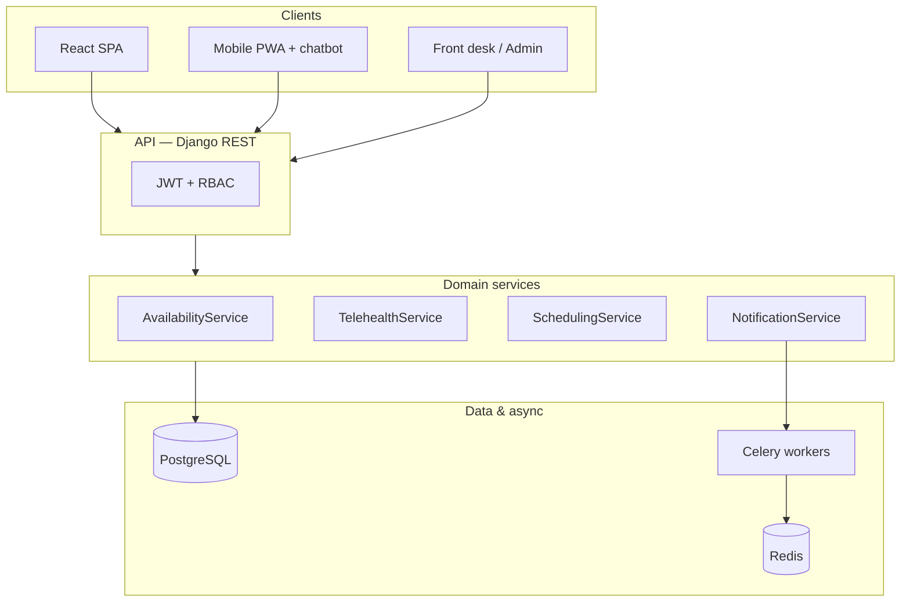

# Our Clinic — Solution Presentation (5 Slides)

**Team 06 · Medical Appointment Coordination**  
**Run demo:** `./run-demo.sh` → http://localhost:8080

**PDF export:** [SOLUTION-SLIDES.pdf](SOLUTION-SLIDES.pdf) · **Print source:** [SOLUTION-SLIDES.html](SOLUTION-SLIDES.html)

---

## Slide 1 — Problem & Vision

### The problem
- Patients rely on **phone/IVR** — long holds, unclear availability, dead ends when a specialty is full (e.g. dermatology)
- **Multi-site clinics** (Brooklyn, Midtown, Queens) make it hard to find the nearest doctor with an open slot
- Front desk juggles **walk-ins, phone bookings, and reminders** without one live view
- Missed appointments when **confirmations and reminders** are manual or inconsistent

### Our vision
**One coordinated platform** for patients, providers, front desk, and admin — aligned with real healthcare appointment-call data (Kaggle 2024).

| Persona | Role |
|---------|------|
| **Maria** | Patient — book online, mobile chat, reminders |
| **Dr. Chen** | Provider — calendar & availability |
| **Elena** | Front desk — check-in, walk-ins, call log |
| **David** | Admin — locations, utilization |

---

## Slide 2 — Requirements

### Functional requirements (MVP — P0)

| Epic | Key user stories | What it must do |
|------|------------------|-----------------|
| **Patient booking** | US-4.6, US-4.7 | Search slots by service; find **closest practitioner** with availability |
| **Mobile channel** | US-4.8 | **Chatbot** — book, nearest doctor, view/cancel appointments |
| **Telehealth fallback** | US-4.9 | When in-person slots are empty → **call doctor** or **book online video visit** |
| **Booking** | US-4.2, US-4.3 | Book, cancel, reschedule with policy rules; no double-booking |
| **Front desk** | US-5.1–5.3 | Walk-in booking, check-in, day schedule across providers |
| **Notifications** | US-7.1, US-7.2 | Confirmation email + **T−24 h reminder** (telehealth includes join link) |

### Non-functional requirements (selected)

| NFR | Target |
|-----|--------|
| Search latency | p95 ≤ 500 ms |
| Booking write | p95 ≤ 800 ms |
| Concurrency | One slot → one appointment (409 on conflict) |
| Security | JWT + RBAC; patients see only their data |
| Data source | Kaggle call transcripts + demo fixtures for **Our Clinic** |

---

## Slide 3 — Design

### Layered architecture

### Core domain model

| Entity | Responsibility |
|--------|----------------|
| **Service** | Patient-friendly care type (Cardio, General Doctor, Skin Care) |
| **Slot** | Bookable unit — `modality`: in-person **or** telehealth |
| **Appointment** | Patient + slot + status; `booking_channel` (web, phone, mobile_chat, **telehealth**) |
| **Provider** | Specialty, location, phone, telehealth enabled |
| **NotificationLog** | Confirmation & reminder audit trail |
| **CallRecord** | Phone/IVR transcripts (Kaggle alignment) |

### Key design decisions
- **Empty in-person search** routes to telehealth — not a dead end (US-4.9)
- **Same booking pipeline** for in-person and video visits
- **Async notifications** — booking succeeds even if email queue is temporarily down

---

## Slide 4 — Solution (what we built)

### Phase 0 — Runnable prototype

| Component | Deliverable |
|-----------|-------------|
| **Mockup** | 17 screens — patient, provider, desk, admin |
| **Mobile app** | `patient/mobile.html` — chatbot, Home, Visits tabs |
| **Search** | By service, closest practitioner (haversine distance) |
| **Telehealth** | Call doctor (`tel:`) + online meeting booking with join URL |
| **Reminders** | T−24 h scheduling, notification log, desk manual send |
| **Mock API** | `prototype/server.py` — availability, closest, notifications |
| **Data** | 3 locations, 6 providers, Kaggle call records, demo fixtures |

### Demo flow (60 seconds)

1. **Maria · Mobile app** → Chat → Book **General Doctor** → confirm in chat  
2. Book **Skin Care** → no in-person slots → **Call Dr. Wong** or **Book online meeting**  
3. **Elena · Front desk** → Check-in → Send reminder  
4. **Appointments** → Simulate 24 h reminders → see email log  

### Tech stack

| Layer | Choice |
|-------|--------|
| **Now (Phase 0)** | HTML/CSS/JS + Python mock server |
| **Planned (Phase 1+)** | Django 5 + DRF + PostgreSQL + Redis/Celery + React (TS) |

---

## Slide 5 — Summary & Next Steps

### What we deliver

> **Our Clinic** replaces phone tag with self-service booking, smart telehealth when slots are full, and automated reminders — one system for the whole practice.

| Benefit | How |
|---------|-----|
| **Fewer calls** | Mobile chatbot + online search |
| **No dead ends** | Call doctor or video visit when in-person is full |
| **Better utilization** | Closest-practitioner search across 3 sites |
| **Fewer no-shows** | Confirmation + T−24 h reminders |
| **Evidence-based** | Requirements grounded in Kaggle call transcripts |

### Status & roadmap

| Phase | Scope | Status |
|-------|-------|--------|
| **0** | Mockup, chatbot, telehealth, mock API | ✅ Done |
| **1** | Django models, JWT auth, seed data | Planned |
| **2** | Booking API, React patient/provider UI | Planned |
| **3** | Front-desk flows, admin config | Planned |
| **4** | Celery email + E2E tests | Planned |

**Repo:** https://github.com/acollant/team06-Medical-Appointment-Coordination  
**Docs:** `docs/PLAN.md` · `docs/ARCHITECTURE.md` · `DEMO.md`

---

## Speaker notes (optional, ~5 min total)

| Slide | Time | Focus |
|-------|------|-------|
| 1 | 1 min | Pain points → four personas |
| 2 | 1 min | P0 stories + NFRs — show you have acceptance criteria |
| 3 | 1.5 min | Architecture diagram + domain entities |
| 4 | 1.5 min | Live demo or screenshots — telehealth is the differentiator |
| 5 | 1 min | Benefits + Phase 1 next |
